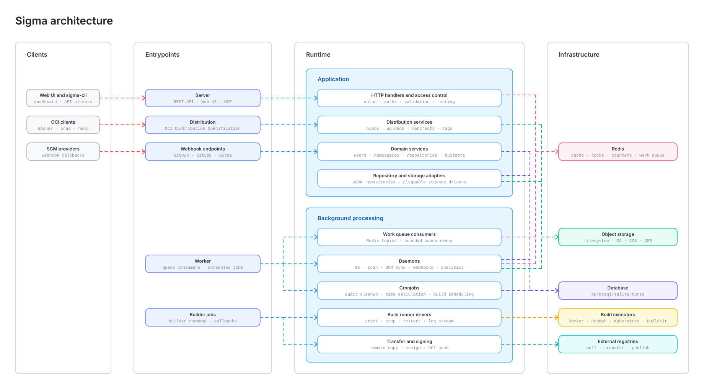

<p align="center">
  <a href="https://github.com/go-sigma/sigma">
    
  </a>
</p>
<h1 align="center">sigma</h1>

  

Sigma is an image registry that is extremely easy to deploy and maintain, and it adheres to the interface standards defined by the [OCI Distribution Specification 1.1](https://github.com/opencontainers/distribution-spec/tree/v1.1.0), it can also support any other client programs that follow the interface definition of the OCI Distribution Specification, such as [oras](https://github.com/oras-project/oras), [apptainer](https://github.com/apptainer/apptainer), [helm](https://github.com/helm/helm), and [nerdctl](https://github.com/containerd/nerdctl).

## Quick Start

Now you can use this command to run a simple server:

```bash
docker run --name sigma -p 3000:3000 --rm tosone/sigma:nightly-alpine
```

The default username and password is: sigma/Admin@123. If you want to modify the default password, please refer to the [configuration instructions](https://docs.sigma.tosone.cn/docs/configuration).

## Demo Server

It is deployed on an AWS EC2 instance (2C4G, 40G disk) running Debian 12.1 as the Linux distribution. The Docker version used is 25.0.3. The demo server was set up following these [instructions](tools/demo-server).

Visit: <https://sigma.tosone.cn>, username/password: sigma/Admin@123

## Architecture

The diagram below maps Sigma's main runtime layers, from client entry points to request handling, background workers, and the infrastructure services they depend on.



## Features

- [x] Support docker registry v2 protocol.
- [x] Support OCI Image v1 Format and OCI Image Index v1 Format.
- [x] Support OCI artifacts such as helm and so on.
- [x] Support OCI sbom.
- [x] Support Image security scan.
- [x] Support registry proxy.
- [x] Support Namespace quota.
- [x] Support Image automatic garbage collection.
- [x] Support Image sign.
- [x] Support Image build in docker, podman and kubernetes.
- [ ] Support Image replication.

## AI Clients and Automation

Sigma provides two integration paths for AI clients and external automation:

- Embedded MCP server: Sigma can expose registry management tools through the
  existing server process. It is disabled by default and can be enabled through
  the `mcp` configuration section. See [MCP Server](docs/mcp.md).
- External REST API skill: `tools/skill/sigma-api-operator` packages a reusable
  skill and `swagger.yaml` so CLI agents such as Claude Code or Copilot CLI can
  discover Sigma APIs and operate resources through HTTP requests.

## Alternatives

- [Distribution](https://distribution.github.io/distribution/)
- [Harbor](https://goharbor.io/)
- [zot](https://zotregistry.io/)
